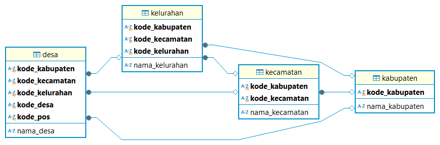

# Kode Wilayah Indonesia didalam SQL

Script ini dijalankan menggunakan [Bun](https://bun.sh/docs/installation). Hasil akhir dari script ini adalah untuk membuat file basisdata dalam format SQLite yang dapat digunakan oleh aplikasi lainnya.

File basis data akan berisi data wilayah Indonesia, seperti nama/kode wilayah/kode pos dari kabupaten, kecamatan, kelurahan, dan desa.

Data disadur dari repository berikut:
1. [cahyadsn/wilayah](https://github.com/cahyadsn/wilayah)
2. [cahyadsn/wilayah_kodepos)[https://github.com/cahyadsn/wilayah_kodepos]

Terimakasih saya ucapkan kepada [@cahyadsn](https://github.com/cahyadsn) yang telah menyediakan data tersebut.

## Cara menjalankan script

Pastikan sudah terinstall [Bun](https://bun.sh/docs/installation). Kemudian jalankan script dengan perintah berikut:

```bash
bun install
bun run .
```

Maka akan terbentuk file basisdata dengan nama `wilayah.sqlite` di direktori `./db`.

## ERD Bais Data


